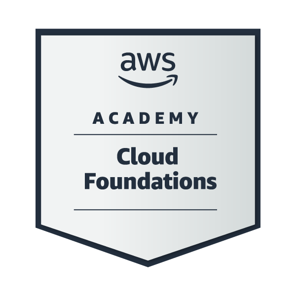

## Hi there, I'm Lauri! 👋

- Linux enthusiast (at the moment using Fedora 43 Workstation with i3/GNOME)
- Currently studying to become a Bachelor in Business Information Technology at JAMK
- Interested in web-development (both frontend and backend) & databases !

## My projects 😎

- [**Froots Smoothie App**](https://github.com/jamktiko/smoothie_testi) - Svelte, TypeScript, Tailwind - [link to website](https://froots-smoothies.netlify.app/)
- [**EverythingShop**](https://github.com/laanhema/jamk-s2024-web-perusteet-lopputyo) - Vanilla HTML CSS, Responsive design - [link to website](https://everythingshop.surge.sh/)
- [**BandBuddy**](https://github.com/laanhema/bandbuddy) - Java
- [**Folder Comparer**](https://github.com/laanhema/foldercomparer) - C#

## My skills⚡

 

- _C#, Java, Regex, HTML, CSS, JavaScript_
- _npm, node.js, TypeScript, Svelte, Git, AWS_
- _Linux, Tailwind, Bootstrap, Vercel, Netlify, MySQL_
- _Vitest, Cypress, GitHub Actions_

## Editors 🔧

 

- _Visual Studio Code (mainly using this), Visual Studio, Eclipse, Sublime Text_

## Operating systems ⚙️

## Achieved badges 🏅

## I'm currently learning... 🧐

- **Angular**
<!-- - **Less**
- **Taiga UI** -->
<!-- - **Vitest & Cypress for testing** -->

<!--  -->

I would like to learn:

- React
- Python

<!-- - Neovim 😱 (learning Vim motions could be useful) -->

<!--  -->

<!-- eventually mby add these if I'm confident enough -->

<!--  -->

<!--
**laanhema/laanhema** is a ✨ _special_ ✨ repository because its `README.md` (this file) appears on your GitHub profile.

Here are some ideas to get you started:

- 🔭 I’m currently working on ...
- 🌱 I’m currently learning ...
- 👯 I’m looking to collaborate on ...
- 🤔 I’m looking for help with ...
- 💬 Ask me about ...
- 📫 How to reach me: ...
- 😄 Pronouns: ...
- ⚡ Fun fact: ...
-->
